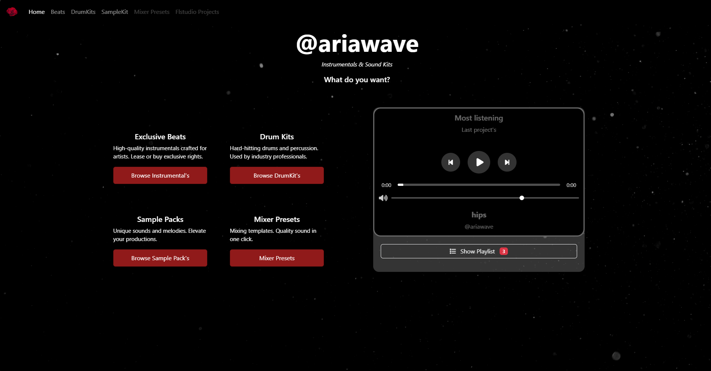
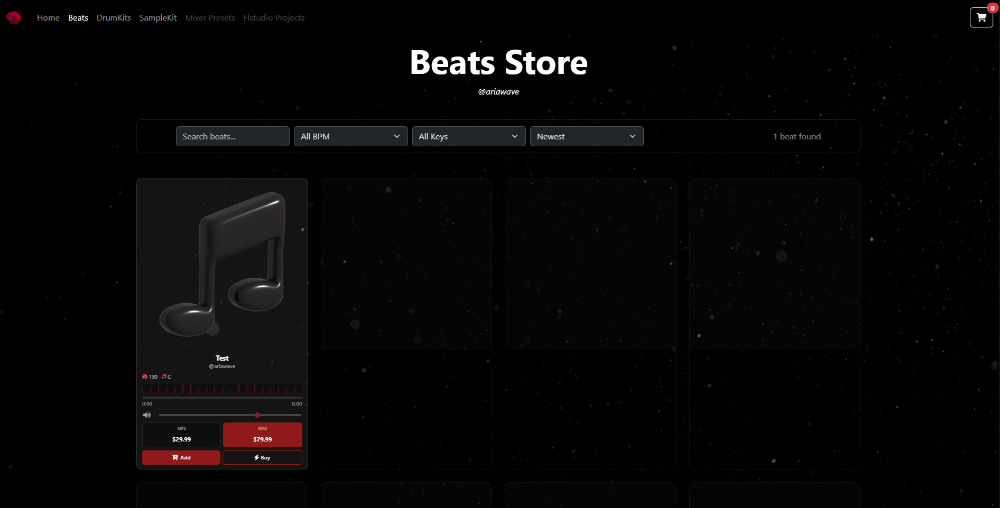
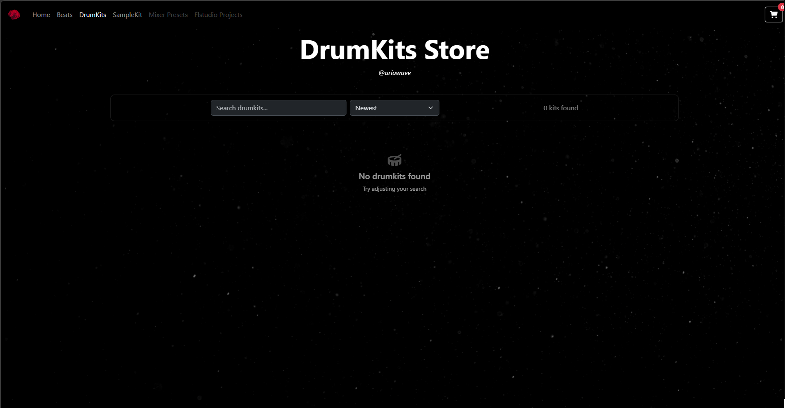
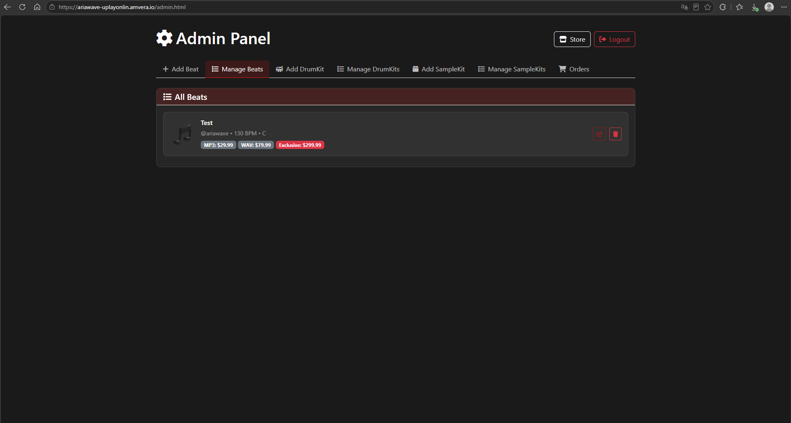

# 🎵 Beats Store
###work in progress
Веб-сайт для продажи музыкальных битов, драмкитов и семплкитов. Функционал аналогичен BeatStars Pro Page — личный магазин для продажи музыки.
## 📸 Скриншоты

### 🏠 Главная страница


### 🎵 Каталог битов


### 🥁 Драмкиты


### 🔐 Админ-панель


### 💳 Крипто-оплата


## 🚀 Возможности

### Для покупателей:
- 🎧 **Каталог битов** — просмотр и прослушивание битов с превью
- 🥁 **Драмкиты** — коллекция ударных инструментов
- 🎼 **Семплкиты** — наборы сэмплов для продакшена
- 🚧 *Mixer Presets* - в процессе реализации
- 🛒 **Корзина покупок** — добавление нескольких товаров
- 🚧 *Оплата с карт РФ* - в процессе реализации
- 💰 **Крипто-оплата** — безопасная оплата через криптовалюту
- 🎟️ **Промокоды** — система скидок и промо-акций
- 🔍 **Фильтры и поиск** — поиск по BPM, тональности, названию
- 📄 **Пагинация** — удобная навигация по каталогу

### Для администратора:
- 🔐 **Админ-панель** — управление контентом
- 📊 **Управление битами, драмкитами и семплкитами** — добавление, редактирование, удаление
- 💵 **Ценообразование** — настройка цен для разных лицензий (Tagged, Untagged, Exclusive)
- 📈 **Статистика** — отслеживание продаж

## 🛠️ Технологический стек

- **Frontend:** HTML5, CSS3, JavaScript (ES6+)
- **Backend:** Node.js, Express
- **UI Framework:** Bootstrap 5
- **Icons:** Font Awesome
- **Deployment:** Docker, Amvera Cloud
- **Payment:** Cryptocurrency payment integration

## 📦 Структура проекта
```text
beats_store/
├── server/ # Backend API
├── source/ # Статические файлы (аудио, изображения, JS, CSS)
├── admin.html # Админ-панель
├── beats.html # Каталог битов
├── drumkits.html # Каталог драмкитов
├── samplekits.html # Каталог семплкитов
├── crypto-payment.html # Страница крипто-оплаты
├── login.html # Страница входа
├── index.html # Главная страница
├── Dockerfile # Конфигурация Docker
├── amvera.yaml # Конфигурация для Amvera
├── render.yaml # Конфигурация для Render
└── package.json # Зависимости Node.js
```
## 🚀 Быстрый старт

### Локальный запуск:

1. **Клонируйте репозиторий:**
```bash
git clone https://github.com/uplayonlin/beats_store.git
cd beats_store
```
2. **Установите зависимости:**
```bash
npm install
```
3.**Запустите сервер:**
```bash
npm start
```
4. **Откройте в браузере:**
```bash
http://localhost:3000
```

---
## 🌐 Деплой
### Amvera Cloud:
Проект настроен для деплоя на Amvera через amvera.yaml.
### Render:
<p>Также поддерживается деплой на Render через render.yaml.</p>

---
## 💳Типы лицензий
<ul><li>Tagged MP3 — бит с водяным знаком (дешевле)</li>
<li>Untagged WAV — бит без водяного знака</li>
<li>Exclusive — эксклюзивные права на бит</li></ul>

---
## Промокоды (SQLITE DB)
<ul><li>Процентные скидки (например, WELCOME10 — 10% off)</li>
<li>Фиксированные скидки (например, SAVE5 — $5 off) </li></ul>

---
## 🔒Безопасность
<p>-  Защита админ-панели через авторизацию</p>
<p>-  Безопасная обработка платежей</p>
<p>-  Валидация данных на клиенте и сервере</p>

---
## 📱Адаптивность
<ul>Сайт полностью адаптивен и корректно отображается на:
<li>💻 Десктопах</li>
<li>🚧 📱 Планшетах</li>
<li>🚧📱 Мобильных устройствах</li> </ul>

---
## 🎨Особенности UI
<p>- ✨ Плавные анимации появления карточек</p>
<p>- 🎨 Современный минималистичный дизайн </p>
<p>- 🌙 Интуитивная навигация</p>

---
##  📞Контакты
<p>Telegram: https://t.me/@imdecember12</p>
<p>GitHub: uplayonlin</p>
